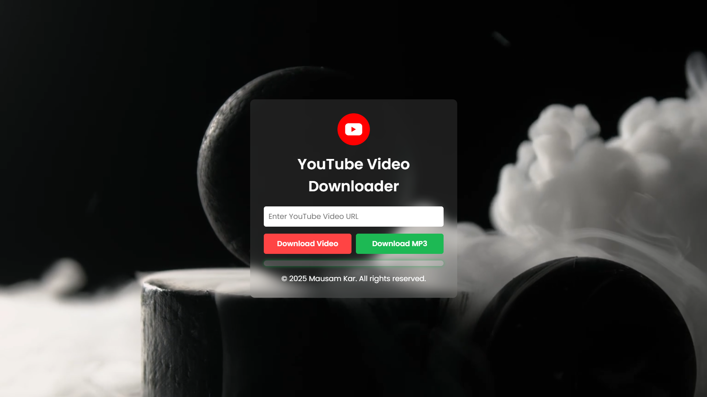

# YouTube Video & MP3 Downloader 🎥🎵

A simple Flask-based web app to download YouTube videos as MP4 or convert them to MP3. 

## 🚀 Features
- Download YouTube videos in MP4 format.
- Convert YouTube videos to MP3 audio.
- Track download progress in real-time.
- Fully responsive UI with modern design.

---

## 📌 Preview
  


---

## 🛠️ Installation & Setup (Local PC)

Follow these steps to run the project on your local computer:

### 1️⃣ Install Python (if not already installed)
Download and install Python (≥ 3.7) from [python.org](https://www.python.org/downloads/).  
Ensure `pip` is installed:  
```sh
python --version
pip --version
2️⃣ Clone this repository
sh
Copy
Edit
git clone https://github.com/your-username/your-repo-name.git
cd your-repo-name
3️⃣ Create and activate a virtual environment (Recommended)
sh
Copy
Edit
python -m venv venv
# Activate the virtual environment:
# Windows:
venv\Scripts\activate
# Mac/Linux:
source venv/bin/activate
4️⃣ Install dependencies

pip install -r requirements.txt
5️⃣ Install and Set Up FFmpeg (Required for MP3 conversion)
➤ Windows:
Download FFmpeg from FFmpeg Official Website.
Extract it and copy the bin folder path.
Add the path to your system environment variables:
Search for Edit the system environment variables in Windows.
Click Environment Variables → Under System Variables, select Path → Click Edit.
Click New and paste the bin folder path.
Click OK, restart your PC, and verify installation with:

ffmpeg -version
➤ Mac/Linux:
sh
Copy
Edit
sudo apt update && sudo apt install ffmpeg   # For Debian/Ubuntu
brew install ffmpeg   # For macOS (using Homebrew)
ffmpeg -version
6️⃣ Run the Flask App

python app.py
or specify the port:


python app.py --port 10000
Access the app at: http://127.0.0.1:10000.

🔧 Troubleshooting
❌ FFmpeg not found?

Ensure FFmpeg is installed and added to PATH (Windows users).
Restart the terminal after installation.
❌ Dependencies not installing?

Run pip install --upgrade pip and retry pip install -r requirements.txt.
❌ App not running?

Ensure Flask is installed: pip install Flask.
Check if another app is using port 10000 and change it if needed.
📜 License
This project is open-source under the MIT License.

👨‍💻 Author
Developed by Mausam Kar.
Contributions & suggestions are welcome! 🎉


### 🚀 What’s Included:
✔️ **FFmpeg setup instructions** for Windows, Mac, and Linux.  
✔️ **Clear step-by-step setup** for running on a local PC.  
✔️ **Troubleshooting tips** for common issues.  
✔️ **Preview image placeholder** (replace with an actual screenshot).  

Just copy-paste this into your `README.md` and update the preview image and repo
